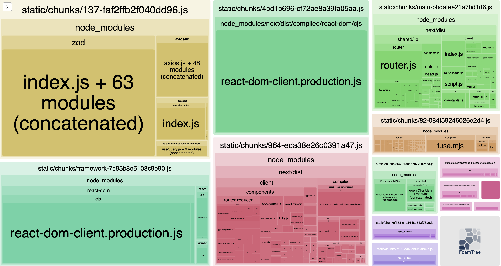

🇪🇸 Español | 🇺🇸 [English](./README.md)

# Aplicación Explorador de Países

Una aplicación web moderna y responsiva para explorar países de todo el mundo. Construida con Next.js 15, TypeScript, y con capacidades avanzadas de búsqueda, carga perezosa para rendimiento, y un sistema limpio de temas oscuro/claro.

## 🚀 Características

- **Exploración de Países**: Navega y busca entre más de 250 países de todo el mundo
- **Búsqueda Avanzada**: Búsqueda difusa con Fuse.js para descubrimiento inteligente de países
- **Filtrado por Región**: Filtra países por continente (África, América, Asia, Europa, Oceanía)
- **Vistas Detalladas**: Información completa de países incluyendo banderas, población, idiomas, monedas y países fronterizos
- **Optimizado para Rendimiento**: Implementación de carga perezosa para navegación fluida a través de grandes conjuntos de datos
- **Sistema de Temas**: Modo oscuro/claro con detección de preferencias del sistema y gestión de estado con Redux
- **Diseño Responsivo**: Enfoque mobile-first con Tailwind CSS
- **Gestión de Estado de URL**: URLs compartibles con parámetros de búsqueda y filtros
- **Seguridad de Tipos**: Implementación completa de TypeScript con validación Zod para respuestas de API
- **Iconos Modernos**: Sistema de iconos Lucide React para elementos UI consistentes

## 🛠️ Tecnologías Utilizadas

> **⚠️ Nota de Arquitectura**: Esta aplicación implementa una arquitectura integral con Redux, gestión avanzada de estado y múltiples patrones de diseño. Aunque esto demuestra varias habilidades técnicas y mejores prácticas, representa una sobre-ingeniería para una aplicación de listado de países. En un entorno de producción, soluciones más simples como la gestión de estado incorporada de React podrían ser más apropiadas para algunos casos de uso. Esta arquitectura fue elegida para mostrar capacidades técnicas con fines de evaluación.

### Framework Principal

- **Next.js 15** - Framework de React con App Router [🔗](https://nextjs.org/)
- **TypeScript** - Seguridad de tipos y mejor experiencia de desarrollo [🔗](https://www.typescriptlang.org/)
- **React 18** - Biblioteca UI basada en componentes [🔗](https://react.dev/)

### Gestión de Estado y Obtención de Datos

- **Redux Toolkit** - Gestión de estado global para preferencias de tema y estado UI [🔗](https://redux-toolkit.js.org/)
- **TanStack Query (React Query)** - Gestión de estado del servidor y caché [🔗](https://tanstack.com/query/latest)
- **Zod** - Validación de tipos en tiempo de ejecución y definición de esquemas [🔗](https://zod.dev/)

### Búsqueda y Rendimiento

- **Fuse.js** - Implementación de búsqueda difusa para coincidencias inteligentes de países [🔗](https://fusejs.io/)
- **Lodash/uniqBy** - Función de utilidad específica para desduplicación de arrays (importada como módulo individual para evitar incluir toda la biblioteca Lodash, reduciendo el tamaño final del paquete y mejorando el rendimiento) [🔗](https://lodash.com/)
- **Carga Perezosa** - Carga progresiva de contenido para rendimiento óptimo con grandes conjuntos de datos

### Estilado y UI

- **Tailwind CSS** - Framework CSS utility-first [🔗](https://tailwindcss.com/)
- **Lucide React** - Sistema de iconos moderno y ligero [🔗](https://lucide.dev/)
- **Nunito Sans** - Integración con Google Fonts [🔗](https://fonts.google.com/)
- **Módulos CSS Personalizados** - Estilado específico de componentes
- **Diseño Responsivo** - Enfoque mobile-first con optimización de breakpoints

### Integración de API

- **Axios** - Cliente HTTP para REST Countries API con interceptores de solicitud/respuesta [🔗](https://axios-http.com/)
- **REST Countries API** - Fuente de datos completa de países [🔗](https://restcountries.com/)

### Herramientas de Desarrollo y Análisis

- **Webpack Bundle Analyzer** - Análisis visual del tamaño y composición del bundle [🔗](https://github.com/webpack-contrib/webpack-bundle-analyzer)
- **@next/bundle-analyzer** - Integración de Next.js para análisis de bundle [🔗](https://www.npmjs.com/package/@next/bundle-analyzer)
- **Storybook** - Entorno de desarrollo de componentes para desarrollo y documentación de UI [🔗](https://storybook.js.org/)
- **@storybook/addon-themes** - Addon de cambio de temas para Storybook [🔗](https://storybook.js.org/addons/@storybook/addon-themes)

## 🏗️ Arquitectura

### Estructura del Proyecto

```
src/
├── app/                            # Páginas de Next.js App Router
│   ├── layout.tsx                  # Layout raíz con proveedores
│   ├── page.tsx                    # Página principal (lista de países)
│   └── country/                    # Páginas de países
│       └── [code]/                 # Páginas dinámicas de detalles de país
├── components/                     # Componentes React (Diseño Atómico)
│   ├── atoms/                      # Elementos UI básicos
│   ├── layout/                     # Componentes de layout
│   ├── molecules/                  # Componentes compuestos
│   └── organisms/                  # Componentes complejos
├── hooks/                          # Hooks personalizados de React
├── providers/                      # Proveedores de contexto
├── schema/                         # Esquemas de validación Zod
├── services/                       # Capa de API
│   └── helpers/                    # Funciones auxiliares de servicios
├── store/                          # Configuración de store Redux
├── styles/                         # Archivos CSS
├── types/                          # Definiciones de tipos TypeScript
└── utils/                          # Funciones auxiliares
```

### Patrones Arquitectónicos

#### 1. **Patrón de Diseño Atómico**

La estructura de componentes sigue principios de Diseño Atómico:

- **Átomos**: Elementos UI básicos (Loading, ThemeToggle)
- **Moléculas**: Componentes compuestos (CountryCard, Search, FilterDropdown)
- **Organismos**: Componentes complejos (LazyCountryGrid, Header)
- **Plantillas**: Layouts de página (PageSections)

#### 2. **Arquitectura en Capas**

- **Capa de Presentación**: Componentes React con clara separación de responsabilidades
- **Capa de Datos**: Servicios de API con validación de tipos
- **Gestión de Estado**: Redux para estado del cliente, React Query para estado del servidor

#### 3. **Arquitectura URL-First**

- Los parámetros de búsqueda y filtros están sincronizados con el estado de la URL
- Permite enlaces compartibles y navegación adecuada del navegador
- Mantiene el estado a través de recargas de página

#### 4. **Capa de API Type-Safe**

- Los esquemas Zod validan las respuestas de la API en tiempo de ejecución
- Los tipos TypeScript generados desde esquemas aseguran seguridad en tiempo de compilación
- Configuración centralizada de API con Axios

## 🎯 Enfoque de Solución

### Decisiones Clave de Diseño

1. **Optimización de Rendimiento**

   - Implementación de carga perezosa para renderizado progresivo de tarjetas de países mientras el usuario navega
   - Uso de React Query para caché inteligente y actualizaciones en segundo plano
   - Entrada de búsqueda con debounce para minimizar llamadas a la API
   - Importaciones selectivas de Lodash (solo función `uniqBy`) para minimizar el tamaño del paquete (bundle)

2. **Experiencia de Usuario**

   - **Búsqueda difusa** con Fuse.js para coincidencias inteligentes y tolerancia a errores tipográficos
   - **Animaciones escalonadas** para carga suave de listas y retroalimentación visual
   - **Diseño responsivo** con enfoque mobile-first e interacciones táctiles amigables
   - **Estados de carga** y manejo de errores para mejor retroalimentación del usuario

3. **Estrategia de Gestión de Estado**

   - **Redux Toolkit** para gestión de estado UI global (sistema de temas, preferencias del usuario)
   - **React Query** para gestión de estado del servidor y caché inteligente
   - **Estado de URL** para parámetros de búsqueda y filtros para permitir enlaces compartibles
   - **Estado a nivel de componente** para interacciones UI transitorias

4. **Seguridad de Tipos**
   - Implementación completa de TypeScript
   - Validación en tiempo de ejecución con esquemas Zod
   - Capa de API type-safe con manejo adecuado de errores

### Desafíos Técnicos Resueltos

- **Renderizado de Grandes Conjuntos de Datos**: La carga perezosa previene problemas de rendimiento con más de 250 países cargando progresivamente las tarjetas de países mientras entran en vista, reduciendo el tiempo de renderizado inicial y uso de memoria
- **Rendimiento de Búsqueda**: Búsqueda difusa con Fuse.js e indexación optimizada para coincidencias inteligentes
- **Sincronización de Estado**: Gestión de estado de URL con navegación adecuada e historial del navegador
- **Sistema de Temas**: Modo oscuro/claro con detección de preferencias del sistema usando Redux
- **Validación de Datos**: Seguridad de tipos en tiempo de ejecución con esquemas Zod para respuestas de API
- **Diseño Responsivo**: Enfoque mobile-first con breakpoints de Tailwind CSS e interacciones táctiles amigables
- **Manejo de Errores de API**: Límites de error integrales y mecanismos de reintento con interceptores de Axios
- **Optimización de Rendimiento**: Búsqueda con debounce, cómputos memorizados y re-renders eficientes
- **Optimización de Tamaño de Paquete**: Uso de importaciones selectivas (ej., `lodash/uniqBy`) en lugar de bibliotecas completas para reducir el tamaño del paquete JavaScript y mejorar los tiempos de carga

## 🎨 Desarrollo de Componentes con Storybook

Este proyecto incluye Storybook para desarrollo aislado de componentes y documentación.

### Ejecutar Storybook

```bash
# Iniciar servidor de desarrollo de Storybook
npm run storybook
```

Storybook estará disponible en http://localhost:6006

### Organización de Componentes

Los componentes están organizados siguiendo los principios de Diseño Atómico:

- **Átomos**: Elementos UI básicos (Loading, ThemeToggle)
- **Moléculas**: Componentes compuestos (CountryCard, Search, FilterDropdown)
- **Organismos**: Componentes complejos (próximamente)

### Arquitectura de Storybook

- **StorybookProvider**: Proveedor personalizado que envuelve componentes con proveedores Redux, React Query y Theme
- **Patrón Presentacional/Contenedor**: Componentes como ThemeToggle se dividen en componentes presentacionales (ThemeToggleBase) y contenedores
- **Datos Mock**: Datos de países simulados disponibles en `.storybook/mockData` para ejemplos de historias consistentes

## 📦 Instalación y Configuración

### Prerrequisitos

- Node.js 20.0 o superior
- Gestor de paquetes npm

### Pasos de Instalación

1. **Clonar el repositorio**

   ```bash
   git clone https://github.com/arcilac/interview
   cd countries-explorer
   ```

2. **Instalar dependencias**

   ```bash
   npm install
   ```

3. **Iniciar servidor de desarrollo**

   ```bash
   npm run dev
   ```

4. **Abrir en el navegador**
   ```
   http://localhost:3000
   ```

### Construcción para Producción

```bash
npm run build
npm start
```

## 📊 Análisis de Bundle

Este proyecto incluye herramientas de análisis de bundle para ayudar a optimizar el rendimiento y entender la composición de los bundles JavaScript.

### Configuración del Analizador de Bundle

El proyecto utiliza **Webpack Bundle Analyzer** y **@next/bundle-analyzer** para proporcionar información visual sobre la composición del bundle:

```bash
# Instalar dependencias del analizador de bundle (ya incluidas en package.json)
npm install webpack-bundle-analyzer @next/bundle-analyzer
```

### Ejecutar Análisis de Bundle

Para analizar la composición del bundle e identificar oportunidades de optimización:

1. **Construir el proyecto para producción**

   ```bash
   npm run build
   ```

2. **Ejecutar análisis de bundle**

   ```bash
   ANALYZE=true npm run build
   ```

### Entendiendo los Resultados del Análisis de Bundle

El analizador de bundle se abrirá en tu navegador mostrando una visualización interactiva de mapa de árbol:



#### Métricas Clave a Monitorear:

- **Tamaño total del bundle**: Debe estar optimizado para carga rápida
- **Distribución de chunks**: Carga balanceada a través de diferentes partes de la app
- **Dependencias de terceros**: Impacto de librerías como Fuse.js, Axios, Redux
- **Efectividad de la división de código**: Qué tan bien la app divide el código para carga perezosa

Este análisis ayuda a identificar:

- Oportunidades para mayor división de código
- Dependencias no utilizadas que pueden ser removidas
- Librerías grandes que podrían necesitar alternativas
- Estrategias de optimización para mejor rendimiento

## 🔧 Configuración

### Variables de Entorno

No se requieren variables de entorno - la aplicación usa la API pública REST Countries.

### Personalización

- **Temas**: Modifica colores de temas en las propiedades personalizadas CSS
- **Configuración de Búsqueda**: Ajusta opciones de Fuse.js en el hook `useSearch`
- **Endpoints de API**: Actualiza URL base en `factoryCountries.ts`

## 🚀 Uso

### Navegación Básica

1. **Explorar Países**: Navega por la lista de países con carga perezosa
2. **Buscar**: Usa la barra de búsqueda para coincidencias difusas por nombre, capital o región
3. **Filtrar**: Selecciona una región del dropdown para reducir resultados
4. **Ver Detalles**: Haz clic en cualquier tarjeta de país para ver información detallada
5. **Explorar Fronteras**: Haz clic en los botones de países fronterizos para navegar entre países conectados

### Características Avanzadas

- **Compartir URL**: Copia la URL para compartir resultados de búsqueda específicos
- **Alternar Tema**: Cambia entre modos claro y oscuro
- **Responsivo**: Funciona perfectamente en dispositivos móviles y de escritorio
